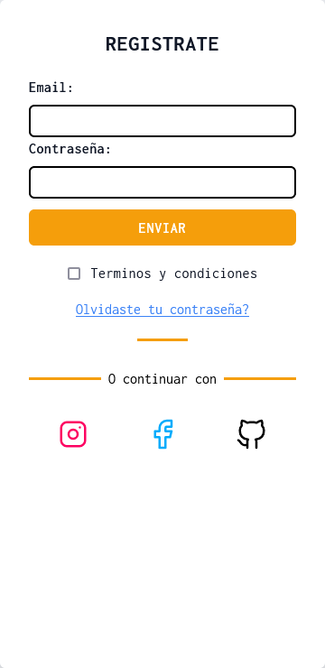
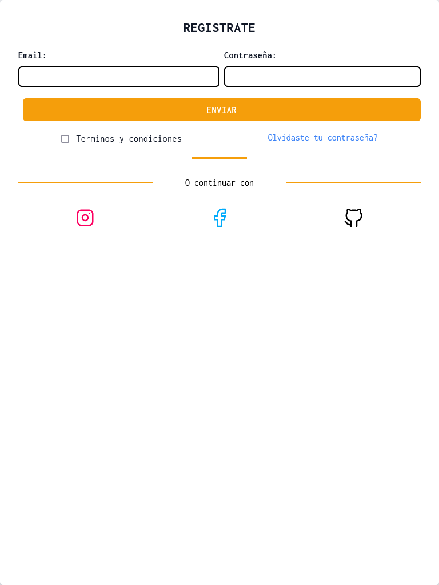

# Login basico con taildwindcss + tabler icons
## descripcion:

login basico desarollado desde 0 usando taildwindcss como frameworkcss y tabler icons como fuente de iconos y google fonts

## Vistas: 

